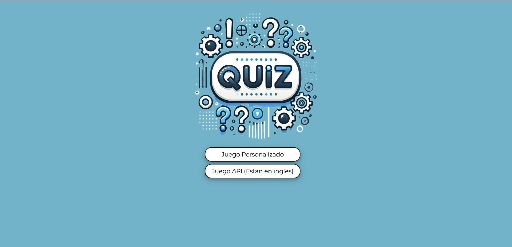
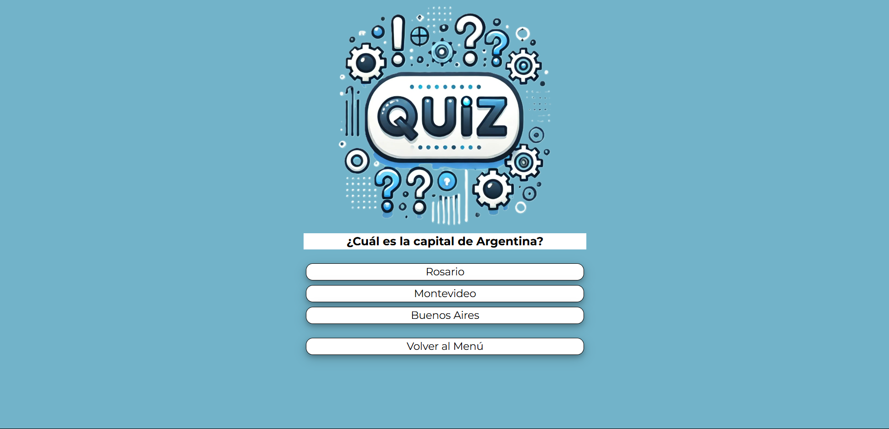
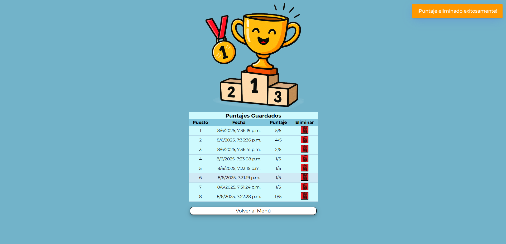
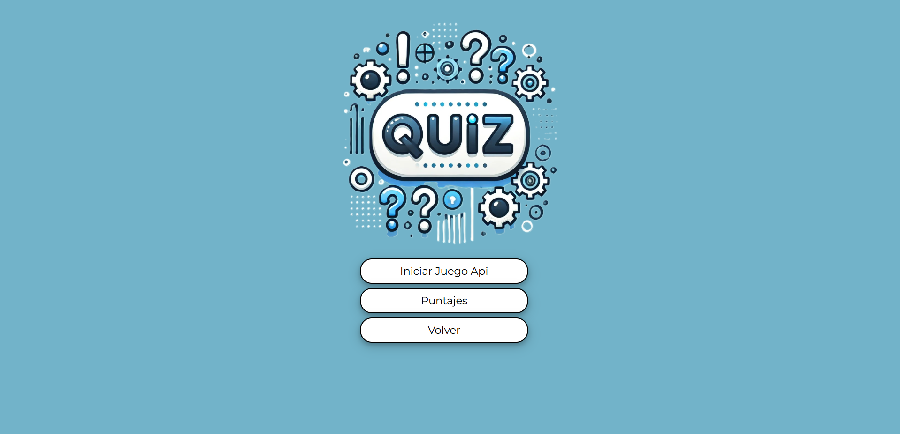

<h1></h1>
<h2>Coderhouse - Comision 69300</h2>
<h3>
  
  
  
  
  
</h3>
<h2>Link de GitHub Pages</h2>
<a href="https://devp-daniel.github.io/coderhouse_javascript/">https://devp-daniel.github.io/coderhouse_javascript/</a>
<h2>Entrega #1 (30-4-25)</h2>
<h3>Objetivos generales</h3>

Armar la estructura base del simulador

Integrar las herramientas JS aprendidas hasta aquí

<h3>Objetivos específicos</h3>

Declara variables, constantes y arrays

Crea una o más funciones JS que generen interacción

Agrega los ciclos de iteración y/o condicionales necesarios, para que tu proyecto funcione correctamente

Integra el uso de la Consola JS y de los cuadros de diálogo Prompt, Confirm y Alert

<h2>Entrega #2 (18-5-25)</h2>
<h3>Objetivos generales</h3>

Mostrar tu simulador JS interactuando con HTML

Integrar las herramientas JS aprendidas hasta aquí

<h3>Objetivos específicos</h3>

Modifica su estructura anterior, integrando JS con JavaScript mediante el uso de DOM y Eventos.

Programa el circuito de interacción completo de la lógica de tu aplicación web, agregando las nuevas herramientas JS aprendidas

Guarda tus objetos o arrays de objetos en localstorage para dejar disponible los datos agregados por el usuario

<table>
  <tr>
    <td></td>
    <td></td>
  </tr>
  <tr>
    <td></td>
    <td></td>
  </tr>
</table>
<h2>Entrega Final (7-6-25)</h2>
<h3>Objetivos generales</h3>

Crear un simulador interactivo

Puede ser un Ecommerce, Cotizador de productos/servicios, Simulador de Home banking con transacciones, Convertidor de monedas/criptomonedas, entre otros.

<h3>Objetivos específicos</h3>

Utilizar datos remotos (o simularlos con JSON)

HTML interactivo (generado desde JS)

Uso de las herramientas más importantes de JS, y librerías externas

Tiene que ser 100% funcional y con la lógica de negocio de tu proyecto elegido (Ejemplo: si creas un Ecommerce, simula el proceso completo de compra) <---------------> Se debe entregar

Proyecto HTML + CSS + JS funcional

<table>
  <tr>
    <td></td>
    <td></td>
  </tr>
  <tr>
    <td></td>
    <td></td>
  </tr>
  <tr>
    <td></td>
    <td></td>
  </tr>
  <tr>
    <td></td>
    <td></td>
  </tr>
</table>
